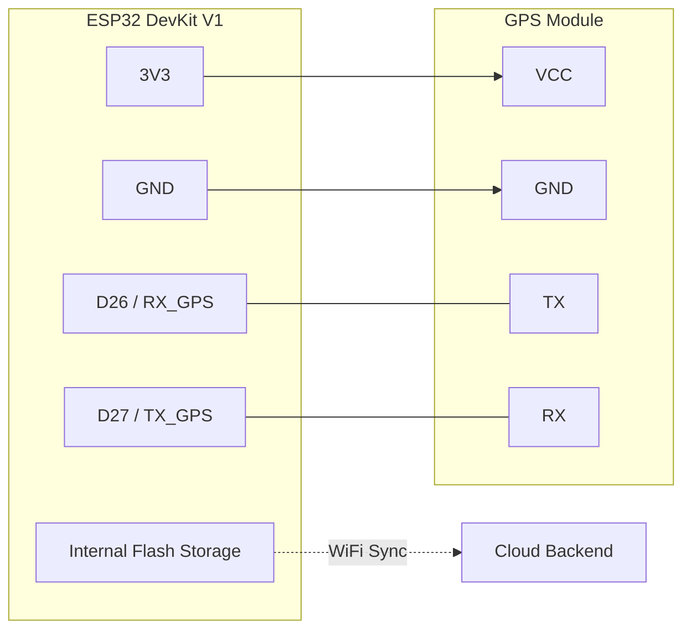

# ESP32 Hardware Wiring Guide

## Storage Architecture: Onboard Flash Memory
**The ESP32 uses internal flash storage (no SD card required)**. All session data is logged to onboard flash (`/sessions/`) and synced to the cloud backend via WiFi.

## Components
1.  **ESP32 DevKit V1** (30-Pin, USB-C)
2.  **GPS Module** (UART Interface)

## Wiring Diagram (Direct Connection)

We use **female-to-female jumper wires** to connect the GPS module directly to the ESP32 headers.

### GPS Module (Generic UART)
**CRITICAL:** Do NOT use RX0/TX0 (Pins 1/3). These are used for USB programming!
We map the GPS to **GPIO 26 & 27**.

| GPS Module Pin | ESP32 Pin | Logic |
| :--- | :--- | :--- |
| **VCC** | **3V3** (3.3V) | Power |
| **GND** | **GND** | Ground |
| **TX** | **D26** (GPIO 26) | Data Out -> In |
| **RX** | **D27** (GPIO 27) | Data In <- Out |

> **Performance Note:**
> - To achieve **10Hz** logging, the UART link runs at **115200 baud**.
> - Ensure jumper wires are short (<15cm) and tight to prevent noise/stuttering at high speeds.
> - The firmware automatically handles the baud rate handshake on boot.

---

## Visual Reference (Mermaid)

## Data Flow
1. **GPS** → ESP32 UART (GPIO 26/27)
2. **ESP32** → Writes CSV to **internal flash** (`/sessions/`)
3. **ESP32** → HTTP uploads to **cloud backend** when WiFi connected
4. **Cloud Backend** → Processes and stores sessions in working directory
