# 🏎️ RaceSense ESP32-P4 Complete 12-Screen UI/UX Design Suite (800×480 Landscape)

This document contains the visual design specifications, high-fidelity mockups, and LVGL v8/v9 component mapping for all **12 screens** in the RaceSense telemetry system, optimized for the Waveshare 4.3" **800×480 Landscape (Horizontal)** IPS Capacitive Touch display.

---

## 1. Boot Splash Screen

### Visual Mockup

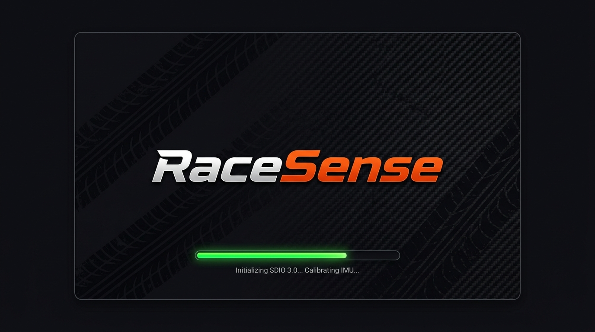

### Visual Layout & Specs
- **Background**: Deep Asphalt Dark (`#09090D`).
- **Center**: Ultra-sharp **RaceSense** wordmark logo asset (`/assets/wordmark_800.png` or LVGL vector label) centered vertically and horizontally.
- **Bottom Status**: Subtle pulsing neon green loading bar (`lv_bar_create`) showing hardware initialization (`Initializing SDIO...`, `Calibrating IMU...`).
- **Duration**: 1–2 seconds, immediately transitioning to `AUTO_COPY` or `HOME_IDLE`.

---

## 2. Home Screen (Dashboard Landing Page - 800×480 Landscape)

### Visual Mockup

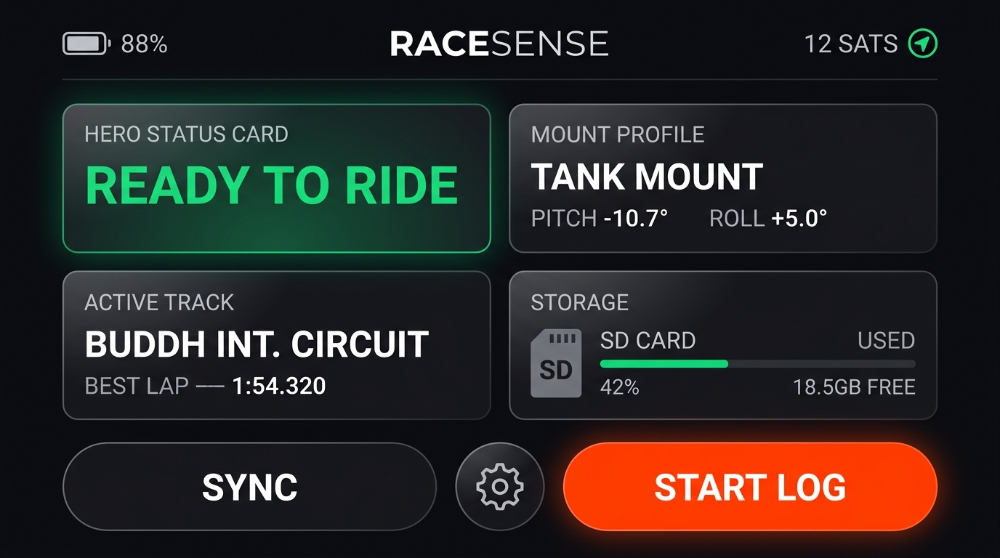

### Component Breakdown & LVGL Mapping (Landscape 2-Column Grid)

| UI Section | Position & Geometry | Content & Behavior | LVGL Implementation Strategy |
|---|---|---|---|
| **Top Header Bar** | Top, 800×50px | Battery status (`88%`), center **RaceSense** brand title, and Satellite status (`12 SATS`). | `lv_obj` header container with `LV_FLEX_FLOW_ROW` and `LV_FLEX_ALIGN_SPACE_BETWEEN`. |
| **Hero Status Card** | Left Col, Top (380×140px) | Prominent status badge (`READY TO RIDE` in Emerald Green). Color dynamically shifts (Green = Ready, Amber = Acquiring GPS, Red = Error). | `lv_obj` card container, `lv_style_set_radius(16)`, large font size `lv_label_create`. |
| **Active Track Card** | Left Col, Bottom (380×140px) | Location pin icon, active track title (**"BUDDH INT. CIRCUIT"**), and personal TBL best lap (`1:54.320`). | `lv_obj` card container with inner flex layout for track metadata. |
| **Mount Profile Card** | Right Col, Top (380×140px) | Motorcycle icon, active profile (**"TANK MOUNT"**), and static mount angles (`PITCH -10.7° / ROLL +5.0°`). | `lv_obj` card container. Updated dynamically when profile is selected in Settings. |
| **Storage Card** | Right Col, Bottom (380×140px) | SD card icon, progress bar (`42% used`), and clear free capacity (`18.5GB FREE`). | `lv_bar_create` progress indicator with percentage label. |
| **Bottom Action Dock** | Bottom, 800×100px | Full-width dock with 3 thumb-friendly touch targets: **`SYNC`** (Left, 320px), **`⚙️ SETTINGS`** (Center circular icon), **`START LOG`** (Right, 360px racing-orange primary action). | `lv_obj` footer container with `LV_FLEX_FLOW_ROW`, `lv_btn_create` with large padding (`lv_style_set_pad_all`) and rounded corners (`lv_style_set_radius(24)`). |

---

## 3. Live Logging Screen (v4 Full-Width Hero Cockpit)

### Visual Mockup

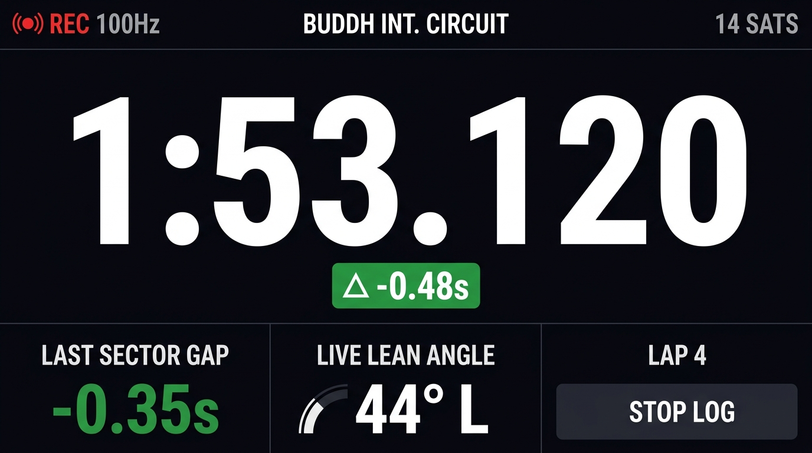

### Component Breakdown & LVGL Mapping (v4 Telemetry Layout)

| UI Section | Geometry & Position | Content & Behavior | LVGL Implementation Strategy |
|---|---|---|---|
| **Top Status Bar** | Top, 800×40px | Pulsing red recording dot + `REC 100Hz`, Active Track Name (`BUDDH INT. CIRCUIT`), Satellite lock (`14 SATS`). | `lv_obj` header with `LV_FLEX_ALIGN_SPACE_BETWEEN`. Pulsing dot via `lv_anim_t` opacity loop. |
| **Full-Width Hero Lap Clock** | Center Upper (800×270px) | **MAXIMIZED 140pt+ Last Completed Lap Time** (`1:53.120`). Spans the full width of the display for effortless reading through visor at 100+ mph. Displays `--:--.---` on Lap 1. | `lv_label_create` with custom ultra-large font asset (`font_montserrat_140` or custom numeric font). Centered horizontally across 800px. |
| **Lap Delta Badge** | Below Hero Clock (180×40px) | Overall Lap Delta pill badge (`Δ -0.48s` in Emerald Green when faster than TBL best, `Δ +0.65s` in Red when slower). | `lv_obj` pill container (`lv_style_set_radius(20)`), dynamic background color based on delta value. |
| **Last Sector Gap Widget** | Bottom-Left (280×130px) | **Last Sector Gap vs TBL** (`-0.35s` in large bold green font when faster, `+0.42s` in red when slower) + `LAST SECTOR GAP` title above. | `lv_obj` card container with large numeric `lv_label_create`. Updated on each sector crossing event from Track Engine. |
| **Live Lean Angle** | Bottom-Center (280×130px) | **Real-time roll/lean angle gauge** (`44° L`) with arc envelope indicator. | `lv_arc_create` widget (`lv_arc_set_angles`, `lv_arc_set_value`) + center numeric label (`44° L`). Updated at 30Hz from Core 0 IMU stream. |
| **Completed Lap Counter** | Bottom-Right Top (180×50px) | Completed lap counter (`LAP 4`). Increments only upon crossing start/finish line. | `lv_label_create` showing `LAP` + completed lap count integer. |
| **Stop Control** | Bottom-Right (160×50px) | `STOP LOG` dark touch button (requires 2-second hold-to-confirm callback). | `lv_btn_create` linked to state machine transition back to `HOME_IDLE`. |

---

## 4. IMU Validation Screen (First 5s of Logging)

### Visual Mockup

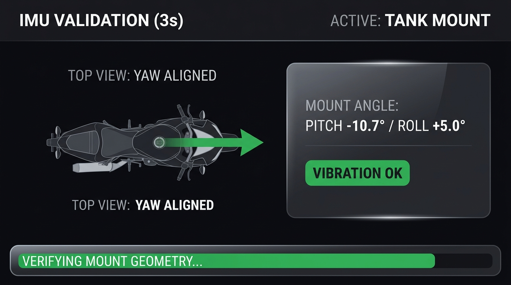

### Component Breakdown & LVGL Mapping
- **Duration**: Active for the first 5 seconds after entering `LOGGING_ACTIVE`. Automatically transitions to Live Logging Screen.
- **Content**:
  - Left Card: Top-view motorcycle diagram showing forward vector (`YAW ALIGNED: 0.0°`).
  - Right Card: Static mount pitch and roll indicators (`PITCH -10.7° / ROLL +5.0°`) + `VIBRATION OK` badge.
  - Bottom Bar: Progress bar (`VERIFYING MOUNT GEOMETRY...`).

---

## 5. Sector Crossing Flash Screen (3s Trackside Feedback)

### Visual Mockup

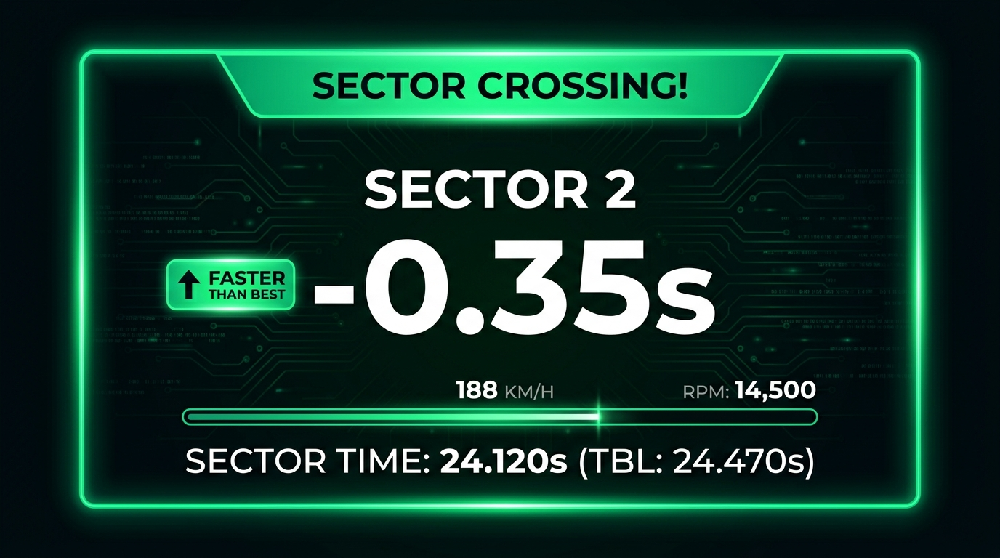

### Component Breakdown & LVGL Mapping
- **Trigger**: Fired by `TrackEngine` on each sector gate crossing. Overlays the screen for 3 seconds.
- **Visuals**:
  - Full-screen high-vis glowing border (Green = Faster, Red = Slower, Orange = Neutral).
  - Huge Sector Title: **`SECTOR 2`**.
  - Enormous Delta Display: **`-0.35s`** with pill badge (`FASTER THAN BEST`).
  - Subtext: `SECTOR TIME: 24.120s (TBL: 24.470s)`.

---

## 6. Sync — WiFi Search Screen

### Visual Mockup

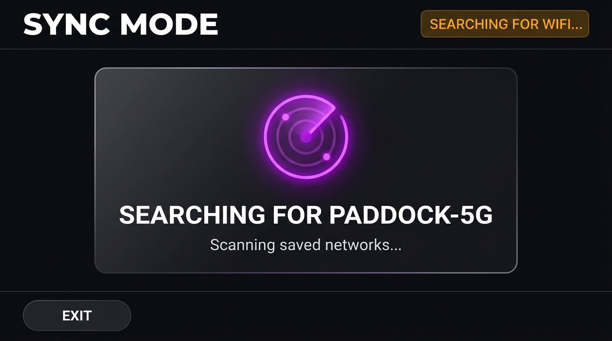

### Visual Layout & Specs
- **Top Header Bar**: `SYNC MODE`, `SEARCHING FOR WIFI...`.
- **Center Card**: Large animated purple pulsing radar search ring icon (`lv_anim_t` scaling loop), displaying `SEARCHING FOR PADDOCK-5G`, subtext `Scanning saved networks...`.
- **Bottom Bar**: Thumb-friendly `EXIT` touch button.

---

## 7. Sync — Heartbeat Handshake Screen

### Visual Mockup

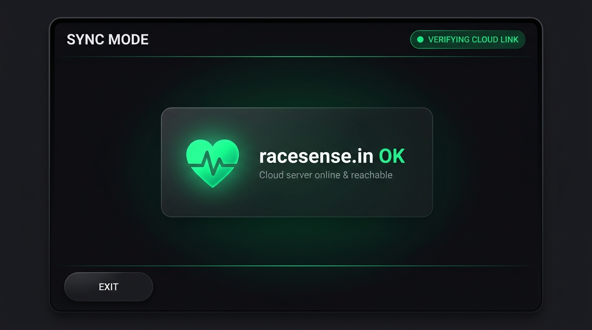

### Visual Layout & Specs
- **Top Header Bar**: `SYNC MODE`, `VERIFYING CLOUD LINK`.
- **Center Card**: Glowing heart icon (Pulse animation).
  - Green Heart = Cloud server reachable (`racesense.in OK`).
  - Red Heart = Server unreachable (Shows `RETRYING...`).

---

## 8. Sync — Upload Progress Screen

### Visual Mockup

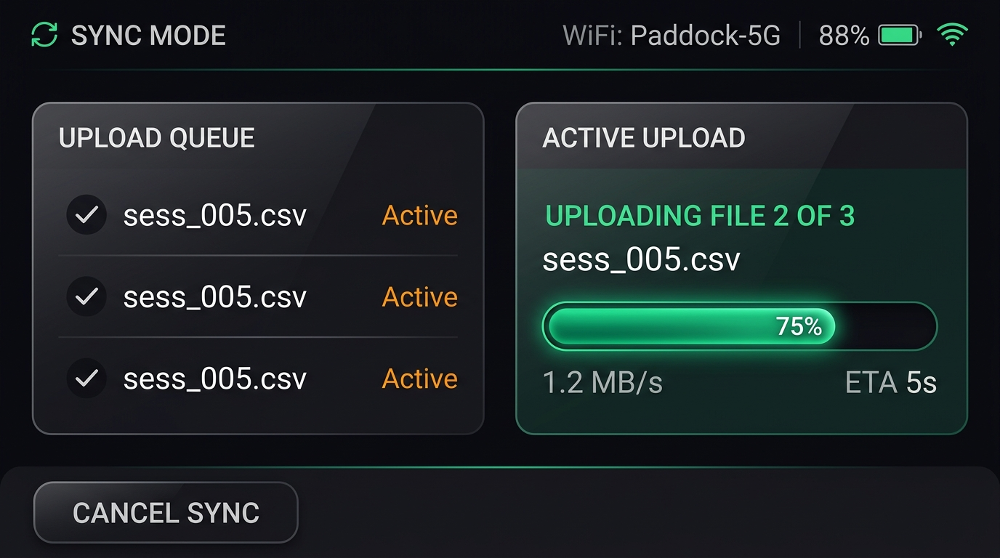

### Component Breakdown & LVGL Mapping (Sync & Batch Upload)

| UI Section | Position & Geometry | Content & Behavior | LVGL Implementation Strategy |
|---|---|---|---|
| **Top Header Bar** | Top, 800×45px | Rotating sync icon + `SYNC MODE`, Connected SSID (`WiFi: Paddock-5G`), Battery (`88%`), WiFi Signal strength icon. | `lv_obj` header container with flex layout. Sync icon animated via `lv_anim_t` rotation loop. |
| **Upload Queue Card** | Left Col (360×320px) | Summary of pending session files (`sess_004.csv`, `sess_005.csv`, etc.) with upload status indicators (`Active`, `Queued`, `Done`). | `lv_obj` card container with `lv_list_create` child view for scrollable pending session files. |
| **Active Upload Card** | Right Col (400×320px) | **File index** (`UPLOADING FILE 2 OF 3`), **Current filename** (`sess_005.csv`), **Sleek glowing progress bar** (`75%`), Transfer speed (`1.2 MB/s`), and **ETA** (`5s`). | `lv_obj` card container, `lv_bar_create` progress bar with smooth value animation (`lv_bar_set_value_anim`), sub-labels for speed and ETA. |
| **Bottom Action Bar** | Bottom (800×80px) | `CANCEL SYNC` touch button on left. | `lv_btn_create` linked to WiFi shutdown and return to `HOME_IDLE`. |

---

## 9. Sync — Complete / Idle Screen

### Visual Mockup

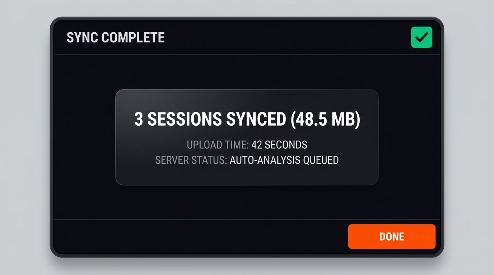

### Visual Layout & Specs
- **Top Bar**: `SYNC COMPLETE`, Green checkmark badge.
- **Center Hero**: Large summary card:
  - `3 SESSIONS SYNCED (48.5 MB)`
  - `UPLOAD TIME: 42 SECONDS`
  - `SERVER STATUS: AUTO-ANALYSIS QUEUED`
- **Bottom Bar**: `DONE` touch button returning to `HOME_IDLE`.

---

## 10. Settings Screen (2×2 Widescreen Grid)

### Visual Mockup

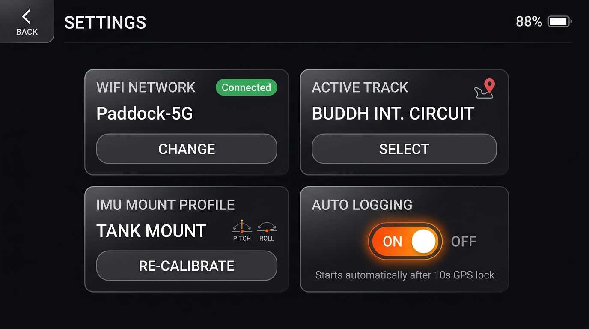

### Component Breakdown & LVGL Mapping

| UI Section | Position & Geometry | Content & Behavior | LVGL Implementation Strategy |
|---|---|---|---|
| **Top Bar** | Top, 800×50px | `BACK` button with back arrow on left, `SETTINGS` title in center, Battery (`88%`) on right. | `lv_obj` header with `lv_btn_create` back button linked to `HOME_IDLE`. |
| **WiFi Network Card** | Grid (Top-Left, 380×175px) | Current connected WiFi (`Paddock-5G`), Green `Connected` badge, and `CHANGE` touch button. | `lv_obj` card with `lv_btn_create` launching WiFi scanner or Captive Portal. |
| **Active Track Card** | Grid (Top-Right, 380×175px) | Location pin icon, active track title (**"BUDDH INT. CIRCUIT"**), and `SELECT` touch button. | `lv_obj` card with `lv_btn_create` opening track selection menu. |
| **IMU Mount Profile Card**| Grid (Bottom-Left, 380×175px)| Active mount profile (**"TANK MOUNT"**), static pitch/roll gauge icon, and `RE-CALIBRATE` touch button. | `lv_obj` card with `lv_btn_create` launching 5-stage IMU calibration wizard. |
| **Auto Logging Card** | Grid (Bottom-Right, 380×175px)| Large glowing orange **ON/OFF Toggle Switch**, subtext *"Starts automatically after 10s GPS lock"*. | `lv_switch_create` widget (`lv_switch_on`/`lv_switch_off`), saving setting to `/data/metadata/device.json`. |

---

## 11. IMU Mount Profile Calibration Wizard

### Visual Mockup

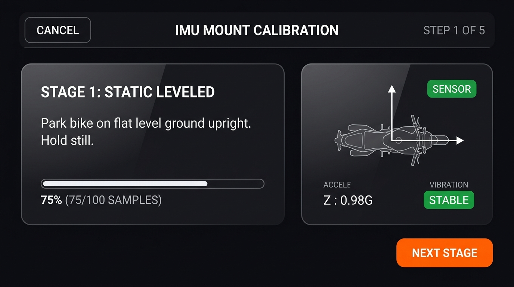

### Component Breakdown & LVGL Mapping (Guided 5-Stage Wizard)

| UI Section | Position & Geometry | Content & Behavior | LVGL Implementation Strategy |
|---|---|---|---|
| **Top Header Bar** | Top, 800×50px | `CANCEL` touch button on left, `IMU MOUNT CALIBRATION` title in center, `STEP 1 OF 5` step indicator on right. | `lv_obj` header with `lv_btn_create` cancel button linked to Settings return. |
| **Instruction Card** | Left Col (420×320px) | Current Stage Title (**"STAGE 1: STATIC LEVELED"**), plain instruction text (*"Park bike on flat level ground upright. Hold still."*), sample progress bar (`75% (75/100 SAMPLES)`). | `lv_obj` card container, `lv_bar_create` progress indicator with sample counter sub-label. |
| **Sensor Feedback Card**| Right Col (340×320px) | Motorcycle sensor orientation diagram, live accelerometer readings (`Z : 0.98G`), and vibration indicator badge (`STABLE`). | `lv_obj` card container with live sensor value labels updated from Core 0 sampling stream. |
| **Action Control** | Bottom-Right (220×70px) | Vibrant orange `NEXT STAGE` touch button. Advances through stages: `STATIC` → `ENGINE` → `LEAN LEFT` → `LEAN RIGHT` → `PUSH`. | `lv_btn_create` linked to calibration solver step machine. |

---

## 12. Captive Portal WiFi Provisioning Active Screen

### Visual Mockup

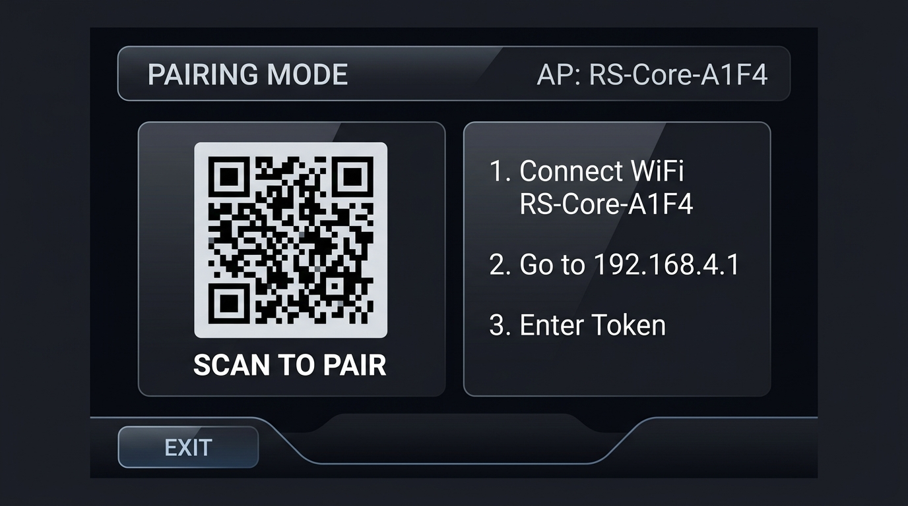

### Component Breakdown & LVGL Mapping (AP Provisioning Screen)

| UI Section | Position & Geometry | Content & Behavior | LVGL Implementation Strategy |
|---|---|---|---|
| **Top Bar** | Top, 800×50px | `PAIRING MODE` title on left, AP name (`AP: RS-Core-A1F4`) on right. Blue breathing ambient glow. | `lv_obj` header with pulsing blue background glow animation. |
| **QR Code Pairing Card**| Left Col (360×340px) | Large high-contrast QR Code containing WiFi AP connect string, subtext **"SCAN TO PAIR"**. | `lv_qrcode_create` widget encoding `WIFI:S:RS-Core-A1F4;T:nopass;;`. Allows instant phone camera WiFi connection! |
| **Instructions Card** | Right Col (400×340px) | Clear 3-step setup instructions: 1. Connect WiFi `RS-Core-A1F4` 2. Open browser to `192.168.4.1` 3. Enter WiFi details & token | `lv_obj` card container with clean numbered `lv_label_create` list. |
| **Action Dock** | Bottom (800×70px) | `EXIT` touch button on left. Shut downs AP mode and returns to `HOME_IDLE`. | `lv_btn_create` button callback stopping DNS server and AP interface. |

---

## 🎨 Master Color Palette Tokens (Motorsport Dark Theme)

- **Background**: `#0D0D11` (Deep Asphalt Dark)
- **Card Surface**: `rgba(255, 255, 255, 0.05)` (Glassmorphism Dark)
- **Card Border**: `rgba(255, 255, 255, 0.10)`
- **Primary Action (Log/Next)**: `#FF6B35` (RaceSense Orange)
- **Status Ready / Connected**: `#00D26A` (Emerald Neon Green)
- **Status Warning / Searching**: `#FFB800` (Warm Amber)
- **Status Error / Bad**: `#FF3B30` (Apex Red)
- **Pairing Glow**: `#007AFF` (Electric Blue)
- **Text Primary**: `#FFFFFF` (Pure White)
- **Text Muted**: `#8E8E93` (Cool Gray)
